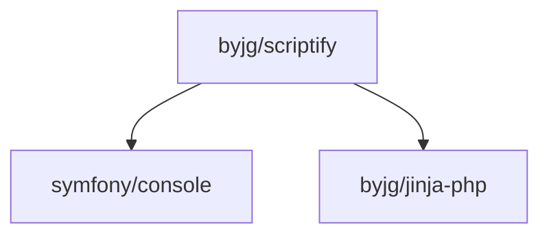

# Scriptify

[](https://github.com/byjg/php-scriptify/actions/workflows/phpunit.yml)
[](http://opensource.byjg.com)
[](https://github.com/byjg/php-scriptify/)
[](https://opensource.byjg.com/opensource/licensing.html)
[](https://github.com/byjg/php-scriptify/releases/)

Transform any PHP class into an executable script callable from command line without changes or refactoring.

## Features

Scriptify allows you to:
- Call any PHP method from the command line
- Install PHP classes/methods as system services (daemon, cron, etc.)
- Call REST endpoints from shell scripts
- Open an interactive PHP terminal with your project's autoloader
- Pass environment variables to your scripts

## Documentation

- [Call a PHP method from command line](docs/script.md)
- [Install a PHP class/method as a service](docs/install.md)
- [Call a REST endpoint from command line](docs/endpoint.md)
- [Interactive PHP terminal](docs/terminal.md)
- [Show method documentation](docs/showdocs.md)
- [Environment variables](docs/environment.md)
- [Play with the service](docs/play.md)

## Installation

Scriptify does not need to be associated with your PHP project.

### Install Locally (Recommended)

```bash
composer require "byjg/scriptify"
```

### Install Globally

```bash
composer global require "byjg/scriptify"
sudo ln -s /root/.composer/vendor/bin/scriptify /usr/local/bin/scriptify

# If you want to share this installation with other users, consider using:
chmod a+x /root
# Note: The root directory will remain unreadable for them, but they can execute scriptify
```

## Dependencies



----
[Open source ByJG](http://opensource.byjg.com)